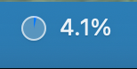
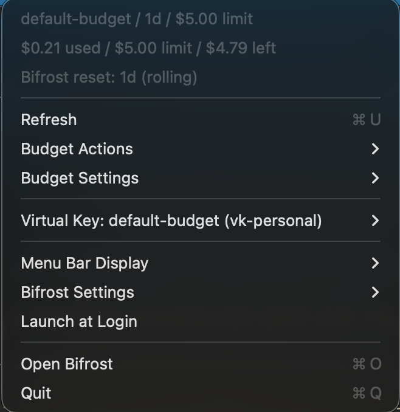

# bifrost-gauge

Local Bifrost setup for LLM budget management, plus a macOS menu bar app that
shows and edits the current budget.

## Install bifrost-gauge

```bash
brew tap tacogips/tap
brew install --cask bifrost-gauge
open -a bifrost-gauge
```

This installs the macOS menu bar app. Bifrost itself still needs to be running
locally; the setup below starts Bifrost on `http://127.0.0.1:18080`.

Bifrost official links:

- Docs: https://docs.getbifrost.ai/
- Provider setup: https://docs.getbifrost.ai/quickstart/gateway/provider-configuration
- GitHub: https://github.com/maximhq/bifrost

## What This Gives You

- Bifrost running locally on `http://127.0.0.1:18080`
- one local Virtual Key: `vk-personal`
- one default hard budget: `budget-personal-default`, currently `$10`
- `bifrost-gauge`, a macOS menu bar app for budget status and controls

Budget state is owned by Bifrost. `bifrost-gauge` only reads and updates Bifrost
through its governance API.

## Screenshots





## Requirements

- macOS
- Nix
- Xcode 26.5 with Swift 6.3.2 for building `bifrost-gauge`
- at least one provider API key, for example `OPENAI_API_KEY` or
  `ANTHROPIC_API_KEY`

## 1. Configure Secrets

```bash
cp .env.example .env
```

Edit `.env`:

```dotenv
BIFROST_ENCRYPTION_KEY=<generate with openssl rand -base64 32>
BIFROST_VK_PERSONAL=sk-bf-local-personal-vk-change-me
OPENAI_API_KEY=
ANTHROPIC_API_KEY=
```

Generate the encryption key:

```bash
openssl rand -base64 32
```

`BIFROST_VK_PERSONAL` is not an upstream provider credential, but it should
still be treated as secret material. It is a local capability token for this
Bifrost instance: anyone who can reach the local Bifrost endpoint and has this
key can spend against the associated budget and rate limits. Keep it in `.env`,
direnv, or a secret store such as kinko, and avoid hard-coding it into checked-in
client config.

## 2. Start Bifrost

Run it in the foreground:

```bash
nix run .#bifrost-host
```

Open the Bifrost UI:

```text
http://127.0.0.1:18080
```

Check the budget:

```bash
curl -fsS http://127.0.0.1:18080/api/governance/budgets \
  | jq '.budgets[] | select(.id == "budget-personal-default")'
```

## 3. Run bifrost-gauge

```bash
swift run bifrost-gauge
```

The app stores user-editable settings here:

```text
~/.config/bifrost-gauge/bifrost-gauge-config.json
```

Use the menu bar item to change:

- Bifrost URL
- selected registered Virtual Key
- displayed budget window
- Bifrost budget reset duration and calendar alignment
- budget usage refresh interval
- default raise amount
- Allow Over-Budget Requests on/off

## 4. Run Bifrost as a macOS Daemon

Install the LaunchAgent:

```bash
scripts/install-launchd.sh
```

Check status:

```bash
launchctl print "gui/$(id -u)/com.local.bifrost-gauge.bifrost"
```

Logs:

```text
~/Library/Logs/bifrost-gauge/bifrost-host-launchd.out.log
~/Library/Logs/bifrost-gauge/bifrost-host-launchd.err.log
```

Uninstall:

```bash
scripts/uninstall-launchd.sh
```

The generated plist is based on:

```text
launchd/com.local.bifrost-gauge.bifrost.plist.template
```

For a nix-darwin configuration example that installs `bifrost-gauge` with
Homebrew Cask and starts both Bifrost and the menu bar app with launchd, see:

```text
examples/nix-darwin-bifrost-gauge.nix
```

The sample installs the app through Cask and runs Bifrost from this repository's
pinned Nix package. It does not require a local clone at runtime and does not
depend on kinko. It reads Bifrost secrets from:

```text
~/.config/bifrost-gauge/bifrost.env
```

## Agent Client Setup

### Claude Code

For Claude Code account/OAuth login, keep Claude Code's normal login and send
the Bifrost Virtual Key only as the local governance header:

```bash
source .env
# or, when using examples/nix-darwin-bifrost-gauge.nix:
# source ~/.config/bifrost-gauge/bifrost.env

unset ANTHROPIC_AUTH_TOKEN
unset ANTHROPIC_API_KEY

ANTHROPIC_BASE_URL=http://127.0.0.1:18080/anthropic \
ANTHROPIC_CUSTOM_HEADERS="x-bf-vk: $BIFROST_VK_PERSONAL" \
claude --model sonnet
```

If you wrap this in fish or Nix aliases, set `ANTHROPIC_CUSTOM_HEADERS` inside a
function so `$BIFROST_VK_PERSONAL` is expanded before Claude Code starts.

### Codex

For Codex, configure Bifrost as an OpenAI-compatible provider and use the
Virtual Key as the provider API key. Keep the key in `.env`, direnv, or another
local secret mechanism; do not hard-code its value in checked-in config.

Example `~/.codex/config.toml` fragment:

```toml
model_provider = "bifrost"
model = "openai/gpt-4o-mini"

[model_providers.bifrost]
name = "Bifrost"
base_url = "http://127.0.0.1:18080/v1"
env_key = "BIFROST_VK_PERSONAL"
wire_api = "responses"
```

Then run Codex from a shell where `BIFROST_VK_PERSONAL` is exported:

```bash
source .env
# or: source ~/.config/bifrost-gauge/bifrost.env
codex -m openai/gpt-4o-mini
```

Use a model name that is enabled in your Bifrost configuration.

## Change the Port

Edit `.env`:

```dotenv
BIFROST_BIND_HOST=127.0.0.1
BIFROST_PORT=18080
```

Then restart Bifrost. If using launchd, rerun:

```bash
scripts/install-launchd.sh
```

Also update `bifrost-gauge`:

```json
{
  "baseURL": "http://127.0.0.1:18080"
}
```

in:

```text
~/.config/bifrost-gauge/bifrost-gauge-config.json
```

## Test a Request

```bash
source .env

curl -fsS http://127.0.0.1:18080/v1/chat/completions \
  -H "Content-Type: application/json" \
  -H "x-bf-vk: $BIFROST_VK_PERSONAL" \
  -d '{
    "model": "openai/gpt-4o-mini",
    "messages": [{"role": "user", "content": "Reply with ok"}]
  }'
```

## More Details

- Vendor-specific setup: [docs/vendor-setup.md](docs/vendor-setup.md)
- macOS daemon, plist example, and gauge config:
  [docs/macos-launchd-and-gauge.md](docs/macos-launchd-and-gauge.md)
- macOS app details: [docs/bifrost-gauge.md](docs/bifrost-gauge.md)

## License

MIT
